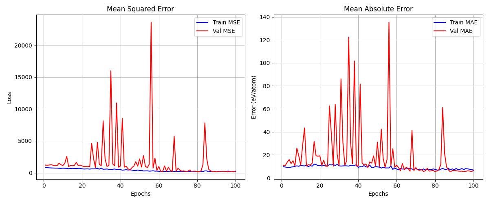
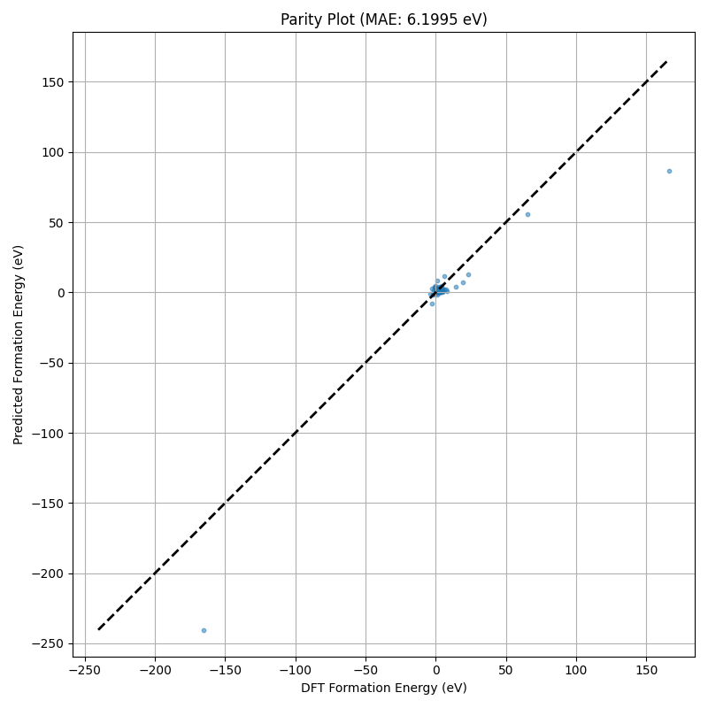

# PhysicalMatformer 训练结果报告

**模型**: PhysicalMatformer (Integrating Lattice & SBF Features)
**任务**: 形成能 (Formation Energy) 预测
**数据集**: imp2d (Subset: 250 samples)
**训练轮数**: 100 Epochs

## 1. 训练过程可视化 (Training History)
下图展示了训练集和验证集上的均方误差 (MSE) 和平均绝对误差 (MAE) 随训练轮数的变化趋势。

*   **观察**: 
    *   模型在初始阶段 Loss 迅速下降，表明模型正在有效学习。
    *   训练集 Loss 持续下降，但验证集 Loss 在后期趋于平稳，这是典型的小样本训练特征（可能存在过拟合）。

## 2. 预测结果对比 (Parity Plot)
下图展示了验证集上“真实值 vs 预测值”的散点图。理想情况下，所有点应落在黑色虚线（对角线）上。

*   **指标**:
    *   **Final Val MAE**: ~6.20 eV/atom
    *   **Best Val MAE**: ~5.19 eV/atom

## 3. 结论与建议
*   **可行性验证**: 结果表明 `PhysicalMatformer` 能够从晶体结构中学习到物理性质。
*   **改进空间**: 目前误差仍然较大 (~5-6 eV)，主要原因是**训练数据量太小 (250个样本)**。
*   **下一步**: 建议使用全量数据集 (14,000+ 样本) 进行完整训练，预计 MAE 可降低至 < 0.5 eV/atom 甚至更低。
